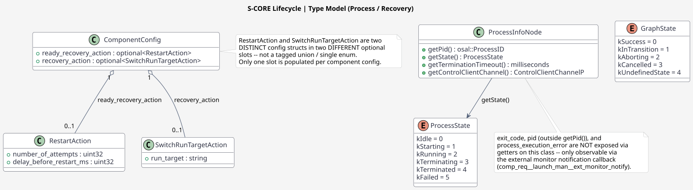
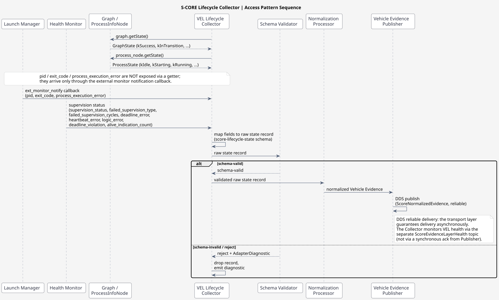
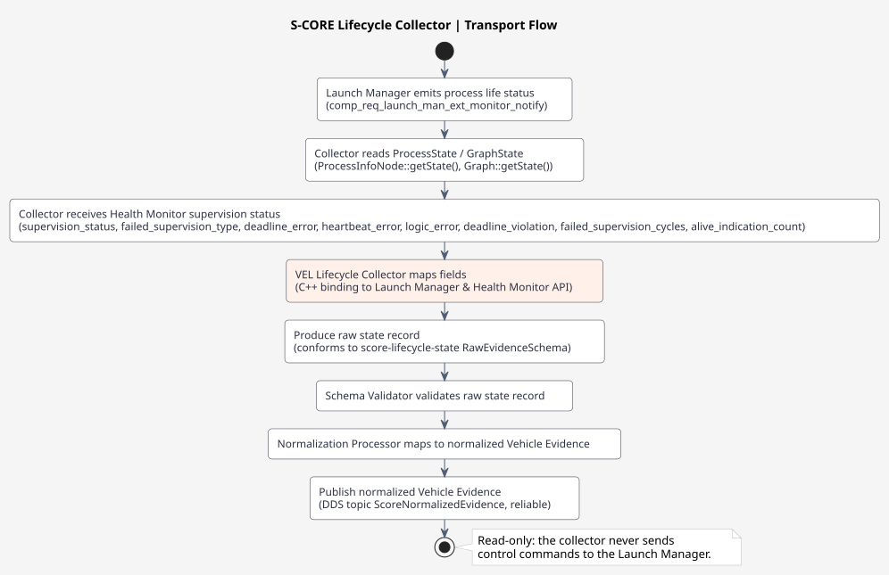

# Lifecycle Collector Design

## Overview

This document defines the **module-specific** design for the S-CORE Lifecycle collector. It covers the API surface, observable state fields, source identity, and transport path specific to the Lifecycle module.

> **TODO:** Common aspects (collector I/O API, lifecycle, error & diagnostic reporting) to be defined in the shared S-CORE collector common design documentation.

---

## 1. Collector Configuration

Reference: `lifecycle-collector.yaml` (`interfaces/score-evidence-layer-package/collectors/lifecycle-collector.yaml`)

```yaml
apiVersion: score.dev/v1alpha1
kind: VehicleEvidenceCollector
metadata:
  name: lifecycle-collector
  version: 1.0.0
spec:
  source:
    transport: s-core-api
    api: lifecycle-state-api
    messageType: ScoreLifecycleState
  inputSchemaRef:
    name: score-lifecycle-state
    version: 1.0.0
    path: schemas/score-lifecycle-state-v1.0.0.yaml
  normalizationRuleRef:
    name: score-lifecycle-to-evidence
    version: 1.0.0
    path: mappings/score-lifecycle-to-evidence-v1.0.0.yaml
  outputSchemaRef:
    name: score-normalized-evidence
    version: 1.0.0
    path: interfaces/vel-output-evidence-package/schemas/score-normalized-evidence-v1.0.0.yaml
  publication:
    transport: dds
    topic: ScoreNormalizedEvidence
    deliveryClass: reliable
  velHealth:
    topic: ScoreEvidenceLayerHealth
    heartbeatPeriod: 1s
  resourceLimits:
    inputQueueDepth: 256
    maximumMessageRate: 1000
```

---

## 2. S-CORE API Surface

**Components:** Launch Manager, Health Monitor (PHM - Platform Health Management).

### 2.1 Observable State

- **Run target state**: which run target is active (string name, e.g. `"Startup"`, `"Off"`, `"Fallback"`).
- **Component states**: started, running, stopped (per the Lifecycle Interface).
- **Process health**: alive/liveliness, exit codes, resource usage.
- **Process runtime identity**: process identifier (`pid`), exposed via the lifecycle API and surfaced in the schema as `details.pid`.
- **Ready conditions**: whether components have reached ready state (inferred from process state transitions).
- **Health Monitor status**: deadline monitor, logic monitor, heartbeat monitor status. This includes the supervision status (ok/failed, derived from whether any per-type error is present), the supervision type that failed (heartbeat/deadline/logic), the specific per-type errors (deadline_error, heartbeat_error, logic_error), deadline violations, failed supervision cycles, alive indication counts, process execution errors, process group identity, and recovery state.

### 2.2 Data Definitions (types, not callable APIs)

- **`ProcessState` enum** (`lifecycle/score/launch_manager/src/daemon/src/process_group_manager/process_state.hpp`):
  ```cpp
  enum class ProcessState : std::uint8_t {
      kIdle = 0,         // process in idle state.
      kStarting = 1,     // process in starting state.
      kRunning = 2,      // process in running state.
      kTerminating = 3,  // process in terminating state.
      kTerminated = 4,   // process in terminated state.
      kFailed = 5        // process failed to start.
  };
  ```

- **`GraphState` enum** (`lifecycle/score/launch_manager/src/daemon/src/process_group_manager/details/graph.hpp`):
  ```cpp
  enum class GraphState : std::uint8_t {
      kSuccess = 0U,        // Graph is not running and process group state is known
      kInTransition = 1U,   // Graph is running, process group state is in transition
      kAborting = 2U,       // Graph is running but has been aborted due to error
      kCancelled = 3U,      // Graph is running but has been cancelled because a new transition is pending
      kUndefinedState = 4U  // Graph is not running but process group state is not known
  };
  ```

The diagram below shows `ProcessState`, `GraphState`, and the recovery-action config types as a type model. `RestartAction` and `SwitchRunTargetAction` are two **distinct** config structs occupying two **different** optional slots (`ready_recovery_action` / `recovery_action`) — not a tagged union or single enum.



[PlantUML source](../../../../../features/diagrams/lifecycle/Lifecycle_type_model.puml)

### 2.3 Lifecycle API Fields

- **`pid` / `exit_code` / `process_execution_error`** — exposed through the lifecycle API via the external monitor notification API (the `comp_req__launch_man__ext_monitor_notify` requirement).
- **Alive reporting** — the Health Monitor reports liveness to the Launch Manager through the Alive API (`report_alive()` / `report_failure()`). Note: this is a **write** path (the supervised process reports itself); VEL cannot use it to read another process's status.
- **Health Monitor supervision types** — the Health Monitor evaluates three supervision types (deadline, heartbeat, logic), each with its own error enum and state snapshot, exposed through the external monitor notification API.

### 2.4 Collector Access Pattern

```cpp
#include "score/mw/launch_manager/process_group_manager/process_state.hpp"
#include "score/mw/launch_manager/process_group_manager/details/graph.hpp"

// 1. Obtain the current process group (graph) state.
score::mw::lifecycle::GraphState graph_state = graph.getState();  // kSuccess, kInTransition, ...

// 2. For each process in the group, obtain its process state.
score::mw::lifecycle::ProcessState proc_state = process_node.getState();  // kIdle, kStarting, kRunning, ...

// 3. Exit code, PID, and process execution error are NOT exposed via getters on ProcessInfoNode
//    (its public API is limited to getPid(), getState(), getTerminationTimeout(),
//    getControlClientChannel() -- there is no public getExitCode()). These fields are only
//    observable through the external monitor notification callback payload
//    (comp_req__launch_man__ext_monitor_notify), which the collector subscribes to.

// 4. Collector maps these to a raw state record conforming to the score-lifecycle-state schema.
```

The sequence below shows the full access-pattern interaction, including the external monitor notification callback path for `pid`/`exit_code`/`process_execution_error`:



[PlantUML source](../../../../../features/diagrams/lifecycle/Lifecycle_collector_sequence.puml)

---

## 3. Source Identity

| Field | Value |
|-------|-------|
| `source_id` | `score-lifecycle` |
| `workload_id` | `launch-manager` or `health-monitor` |
| `resource_id` | `component:<name>` or `run-target:<name>` or `monitor:<type>` |

---

## 4. State Fields (Raw Evidence Schema)

The collector produces raw state records conforming to the `score-lifecycle-state` schema (`interfaces/score-evidence-layer-package/schemas/score-lifecycle-state-v1.0.0.yaml`):

| Field | Path | Type | Required |
|-------|------|------|----------|
| `message_id` | `$.message_id` | string | ✓ |
| `source_id` | `$.source_id` | string | ✓ |
| `workload_id` | `$.workload_id` | string | ✓ |
| `execution_id` | `$.execution_id` | string | ✓ |
| `resource_id` | `$.resource_id` | string | ✓ |
| `timestamp_ns` | `$.timestamp_ns` | uint64 | ✓ |
| `state` | `$.state` | enum | ✓ |
| `previous_state` | `$.previous_state` | enum | – |
| `transition_time_ns` | `$.transition_time_ns` | uint64 | – |
| `run_target` | `$.details.run_target` | string | – |
| `exit_code` | `$.details.exit_code` | int32 | – |
| `pid` | `$.details.pid` | uint32 | – |
| `graph_state` | `$.details.graph_state` | enum | – |
| `supervision_status` | `$.details.supervision_status` | enum | – |
| `failed_supervision_cycles` | `$.details.failed_supervision_cycles` | uint32 | – |
| `failed_supervision_type` | `$.details.failed_supervision_type` | enum | – |
| `deadline_error` | `$.details.deadline_error` | enum | – |
| `heartbeat_error` | `$.details.heartbeat_error` | enum | – |
| `logic_error` | `$.details.logic_error` | enum | – |
| `deadline_violation` | `$.details.deadline_violation` | bool | – |
| `alive_indication_count` | `$.details.alive_indication_count` | uint32 | – |
| `process_execution_error` | `$.details.process_execution_error` | uint32 | – |
| `process_group_id` | `$.details.process_group_id` | string | – |
| `recovery_state` | `$.details.recovery_state` | string | – |

---

## 5. Transport Path



[PlantUML source](../../../../../features/diagrams/lifecycle/Lifecycle_collector_transport_flow.puml)

---

## 6. S-CORE API Boundary

VEL can only collect data that S-CORE exposes through a **stable, public, external-facing API**. For the Lifecycle module:

- **Allowed**: Reading `ProcessState`, `GraphState`, `pid`, `exit_code`, `process_execution_error`, and Health Monitor supervision status via the external monitor notification API.
- **Not allowed**: Sending control commands (start/stop/restart processes), invoking `report_alive()` / `report_failure()` (write path), or any lifecycle/process/hardware control operations.

This satisfies `saf_req__vel__*` (no lifecycle/process/container/hardware control, no coordination, no OEM decisions).

---

## 7. Traceability

| Item | Reference |
|------|-----------|
| Design | Lifecycle Collector Design |
| Requirements | FR-VEL-003, AOU-VEL-002 |
| Collector config | `lifecycle-collector.yaml` (`interfaces/score-evidence-layer-package/collectors/lifecycle-collector.yaml`) |
| Input schema | `score-lifecycle-state-v1.0.0.yaml` (`interfaces/score-evidence-layer-package/schemas/score-lifecycle-state-v1.0.0.yaml`) |
| Normalization mapping | `score-lifecycle-to-evidence-v1.0.0.yaml` (`interfaces/score-evidence-layer-package/mappings/score-lifecycle-to-evidence-v1.0.0.yaml`) |