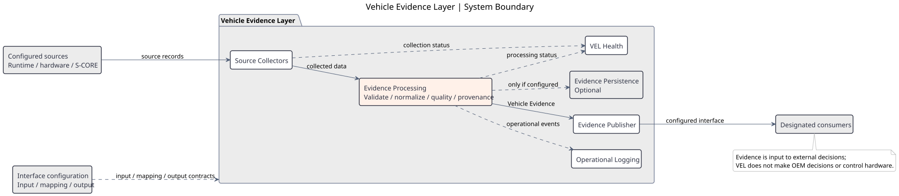
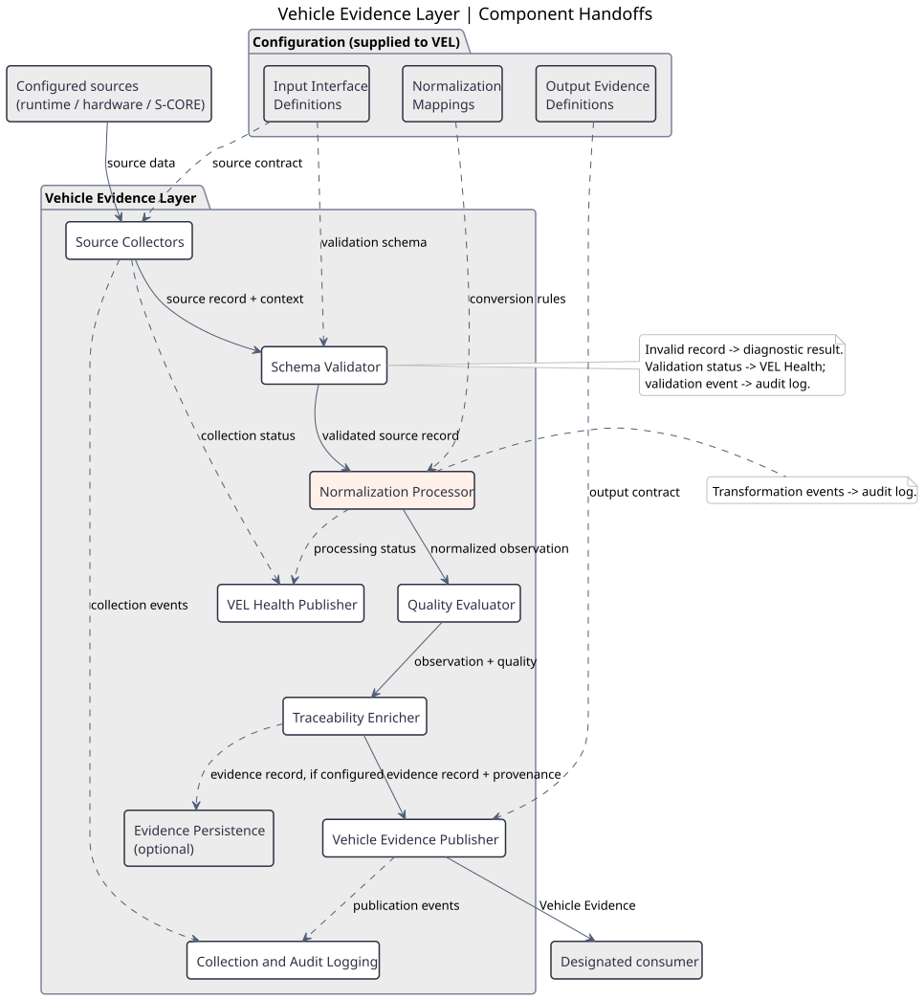
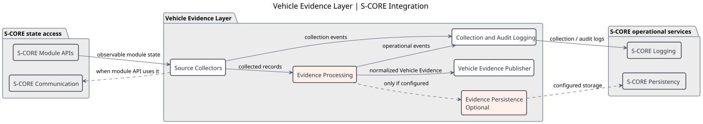
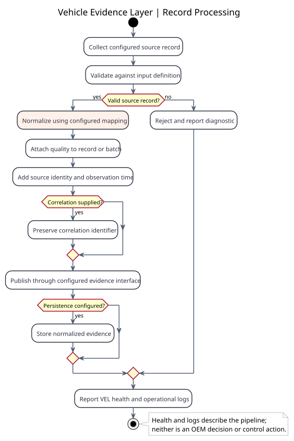
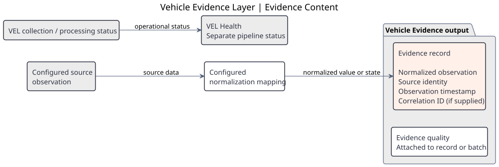

# Vehicle Evidence Layer Architectural Design Draft

## 1. Scope and Design Position

Vehicle Evidence Layer (VEL) collects configured runtime, hardware, and S-CORE module state information, normalizes heterogeneous source data, and exposes Vehicle Evidence to designated consumers.

VEL is an evidence producer. It does not perform multi-node coordination, boot sequencing, workload lifecycle execution, process or container control, hardware control, policy decisions, or final OEM vehicle decisions.

The architecture separates functional responsibilities from deployment. A deployment may host several VEL components in one process, but the functional boundaries remain explicit in the design.

## 2. Architecture Overview

The overview shows the Vehicle Evidence Layer boundary: configured sources and interface configuration feed VEL, which exposes Vehicle Evidence to designated consumers. Optional persistence and operational outputs remain separate from OEM decisions and control.



[Overview PlantUML source](../features/diagrams/VEL_architecture_overview.puml)

The component view places collectors, processing, publication, optional persistence, health, and logging inside the Vehicle Evidence Layer boundary; configured sources, supplied interface definitions, and designated consumers remain outside it. Its arrows identify the data or configuration passed between components; the internal component flowchart below shows the order and failure branches instead. Optional persistence receives evidence records, but whether the publisher also retrieves stored evidence is an open integration decision, not a required path.



[Component PlantUML source](../features/diagrams/VEL_architecture_components.puml)

The Vehicle Evidence Layer is organized into five functional areas:

- **Evidence Ingestion**: Source Collectors read configured runtime, hardware, and S-CORE state data through accessible files, commands, operating-system interfaces, or S-CORE APIs.
- **Evidence Processing**: Schema Validator checks source records; Normalization Processor applies configured mappings; Quality Evaluator assigns evidence quality; Traceability Enricher attaches source identity, observation time, and supplied correlation information.
- **Evidence Management**: Evidence Persistence stores normalized evidence only when persistence is configured for the deployment.
- **Evidence Publication**: Vehicle Evidence Publisher exposes the normalized evidence contract, while VEL Health Publisher exposes the health of the VEL collection pipeline.
- **Observability**: Collection and Audit Logging records collection, validation, normalization, and publication events without becoming part of the Vehicle Evidence contract.

## 3. Configuration Boundary

Configuration defines the source and evidence contracts:

- Input Interface Definitions describe source fields, types, and requiredness.
- Normalization Mappings describe source-to-evidence field mapping, unit conversion, state conversion, and quality rules.
- Output Evidence Definitions describe the normalized Vehicle Evidence fields exposed to consumers.

These artifacts allow a new source to be added through configuration and a platform-specific collector without changing common evidence processing behavior.

The Output Evidence Definitions capture the aggregation data format agreed with the responsible data-format stakeholders (FR-VEL-016). The Vehicle Evidence Publisher exposes evidence using the configured output contract; this does not imply a separate aggregation or multi-node coordination component. The format remains an open design item until agreed.

## 4. Component Responsibilities

| Component | Responsibility | Boundary |
| --- | --- | --- |
| Source Collectors | Read configured source data and provide source context | Platform-specific implementation; no normalization policy |
| Schema Validator | Validate source records against input definitions | Reject or diagnose invalid source data |
| Normalization Processor | Transform source representations into Vehicle Evidence representations | Applies configuration; does not make OEM decisions |
| Quality Evaluator | Attach validity, freshness, completeness, and mapping quality | Describes evidence quality; does not interpret vehicle behavior |
| Traceability Enricher | Attach source identity, observation time, and supplied correlation information | Preserves provenance of observations |
| Evidence Persistence | Store normalized evidence when configured | Optional deployment capability |
| Vehicle Evidence Publisher | Expose normalized Vehicle Evidence through the configured output interface | Evidence publication only |
| VEL Health Publisher | Expose collection and processing health | VEL operational status only |
| Collection and Audit Logging | Record operational and audit events | Separate from evidence content |

At the Vehicle Evidence Publisher to designated consumer boundary, VEL applies the security mechanisms and consumer access rules selected by the deployed environment (SEC-VEL-001, SEC-VEL-004), uses environment-supplied caller identity when authentication is required (SEC-VEL-003), and supports the selected integrity method (SEC-VEL-005). VEL does not define or operate its own authentication authority (SEC-VEL-002). The deployment-specific mechanisms and transport are not fixed here.

## 5. S-CORE Integration



[PlantUML source](../features/diagrams/SCORE_architecture_with_VEL.puml)

This view expands the S-CORE edge of the component architecture without changing its collection-to-processing-to-publication path. Source Collectors observe module state; Evidence Processing produces normalized evidence for the Vehicle Evidence Publisher. Collection and Audit Logging sends operational events to S-CORE Logging. S-CORE Communication is a conditional means of accessing a module API, not the source of module-state data. The deployed module API contract determines whether it is needed; no specific communication profile or state fields are fixed by this design. S-CORE Persistency may be used for optional evidence storage. VEL Health is shown in the component architecture because it has no direct S-CORE service dependency here.

VEL uses S-CORE services only at their applicable boundaries:

- S-CORE Modules provide observable module state through APIs exposed by the deployed environment.
- Source Collectors use S-CORE Communication only when the deployed module API uses it.
- S-CORE Logging receives VEL collection and audit logs.
- S-CORE Persistency may provide configured evidence persistence.

These integrations do not turn VEL into a coordinator, controller, policy manager, or decision-maker.

## 6. VEL Internal Component Flow



[PlantUML source](../features/diagrams/VEL_internal_component_flow.puml)

This view focuses on the internal processing flow rather than repeating the architecture overview. It shows the data artifacts at each stage, the invalid-record diagnostic path, and the separation between normalized Vehicle Evidence, optional persistence, VEL Health, and operational logging.

```text
source data
    -> schema validation
    -> normalization
    -> quality evaluation
    -> traceability enrichment
    -> persistence and/or publication
```

Logging observes this flow, while configuration supplies the contracts and rules used by each processing step.

## 7. Vehicle Evidence Content



[PlantUML source](../features/diagrams/VEL_evidence_record_content.puml)

Each evidence record contains a normalized observation, source identity, and an observation timestamp. It also contains a correlation identifier when the source provides one. Evidence quality applies to each record or evidence batch, whereas VEL Health reports the collection and processing pipeline separately. The diagram shows logical content, not finalized field names or an output schema.

Configured input definitions and normalization mappings determine how source data becomes an observation. The following are examples, not mandatory source formats or fixed transformations:

| Source example | Possible configured processing | Evidence observation |
| --- | --- | --- |
| Runtime metric | Convert a source unit and validate its range | Normalized numeric value and unit |
| Hardware metric or status | Validate a measurement or map an availability state | Resource measurement or operational state |
| S-CORE module state | Map a source state, including unknown values | Normalized module state |
| Event or fault, when configured | Map a code or preserve an unknown original value | Typed event or fault observation |

Execution context, when supplied, provides identity and correlation information for these observations; it is not necessarily a separate evidence record. The configured output interface exposes the resulting Vehicle Evidence to designated consumers.

## 8. Open Design Items

- Confirm the input interface definition, output evidence definition, and normalization mapping formats with the responsible data-format stakeholders.
- Confirm platform-specific collector interfaces and S-CORE API profiles for each deployment environment.
- Decide whether normalized evidence persistence and specific external transports are required for each integration.
