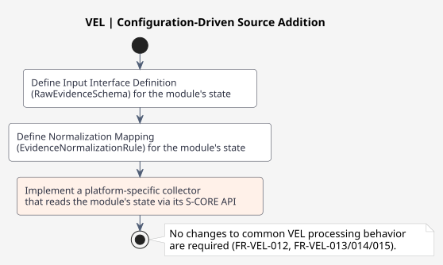

# 설계: S-CORE 모듈 입력 처리

> **관련:** FR-VEL-003 (S-CORE 모듈 상태 수집), AOU-VEL-002, FR-VEL-013 (입력 인터페이스 구성)
> **참조:** [s-core-modules](s-core-modules/lifecycle-input-design.md) — 모듈별 입력 설계. [Collectors](../../evidence-ingestion/s-core-state-collection/collectors/lifecycle-collector-design.md) — 수집기가 S-CORE API에서 이 상태를 읽는 방법.

## 1. 목적

이 문서는 VEL의 입력 인터페이스 계약이 **S-CORE 모듈 상태**를 원시 입력 소스로 처리하는 방법을 정의합니다. S-CORE 런타임 모듈 중 S-CORE API를 통해 관찰 가능한 상태를 노출하는 모듈을 다루며, S-CORE 참조 통합 워크스페이스에서 추적됩니다.

이 설계는 입력 스키마 구조의 구체적인 적용입니다. S-CORE 모듈 소스가 준수해야 하는 `RawEvidenceSchema` 인스턴스를 정의하며, 동일한 공통 필수 필드와 계약 구조를 사용합니다. 벤더-NPU 예제를 보완하여 S-CORE 모듈을 상태 기반 데이터를 가진 별도의 소스 범주로 모델링합니다.

## 2. 설계 위치

VEL 아키텍처에 따르면:

- **FR-VEL-003**: "시스템은 배포 환경에서 노출된 S-CORE API를 통해 구성된 S-CORE 모듈 상태 정보를 수집해야 한다."
- **AOU-VEL-002**: "각 배포 환경은 구성된 수집기에 필요한 S-CORE API와 운영 체제 접근을 제공한다."
- **FR-VEL-013**: "시스템은 구성 기반 입력 인터페이스를 지원해야 하며, 새 소스를 추가해도 공통 Evidence Layer 변경이 필요하지 않아야 한다."
- VEL은 **evidence 생산자**이며, 조정자/제어기가 아닙니다. S-CORE 모듈 상태를 **읽기만** 하며 제어 작업을 호출하지 않습니다 (`saf_req__vel__*` 충족 — 라이프사이클/프로세스/컨테이너/하드웨어 제어 없음, 조정 없음, OEM 결정 없음).
- S-CORE 데이터는 일반적으로 **상태 기반**입니다 (Evidence Content Map, 아키텍처 섹션 7).

이는 S-CORE 모듈 입력이 명령/제어 상호작용이 아닌 S-CORE API를 통해 읽는 **상태 관찰**로 모델링됨을 의미합니다.

## 3. S-CORE 모듈 소스 모델

### 3.1 소스 범주

VEL은 각각 고유한 입력 인터페이스 정의를 가진 세 가지 소스 범주를 구분합니다:

| 범주 | 예시 소스 | 데이터 특성 |
| --- | --- | --- |
| 런타임 메트릭 | CPU, GPU, NPU 사용률 | 단위 및 범위 중심 |
| 하드웨어 데이터 | 센서 상태, 장치 상태 | 측정 또는 운영 상태 |
| **S-CORE 모듈 상태** | Lifecycle | **상태 기반** |

### 3.2 S-CORE 모듈 인벤토리 (VEL 관련 하위 집합 — Lifecycle)

다음 S-CORE 모듈은 **VEL 관련 소스**입니다 — 실제 S-CORE API를 통해 관찰 가능한 상태를 노출하며 참조 통합 `known_good.json`에 고정되어 있습니다:

| 모듈 | 관찰 가능한 상태 (예시) | VEL 수집기가 사용하는 S-CORE API | 소스 ID |
| --- | --- | --- | --- |
| **Lifecycle** | Launch Manager: 컴포넌트 상태 (시작됨/실행 중/중지됨), 실행 대상, 준비 상태, 프로세스 상태, 종료 코드. Health Monitor: 데드라인/로직/하트비트 모니터 상태. | Launch Manager 외부 모니터 알림 (`comp_req__launch_man__ext_monitor_notify`), `ProcessState` 열거형, `GraphState` 열거형 | `score-lifecycle` |

> **접근성 참고 (Lifecycle):** VEL은 안정적이고 공개된 외부 API를 통해 노출된 데이터만 수집할 수 있습니다. `pid`, `exit_code`, `process_execution_error`를 포함한 모든 라이프사이클 필드는 S-CORE 외부 모니터 알림 API (`comp_req__launch_man__ext_monitor_notify`)를 통해 노출됩니다. 모듈별 세부 사항은 [lifecycle-input-design.md](s-core-modules/lifecycle-input-design.md)를 참조하세요.

### 3.3 S-CORE 모듈 소스 식별

각 S-CORE 모듈은 공통 필수 필드를 준수하는 안정적인 식별자를 가진 별개의 소스입니다:

| 필드 | 예시 | 설명 |
| --- | --- | --- |
| `message_id` | `msg-0001` | 원시 소스 메시지의 고유 식별자 (추적성). |
| `source_id` | `score-lifecycle` | S-CORE 모듈 식별자. |
| `workload_id` | `launch-manager` | 모듈 상태를 노출하는 워크로드/프로세스. |
| `execution_id` | `exec-42` | 실행 인스턴스; 상관 식별자로도 사용. |
| `resource_id` | `component:networking` | 모듈 내에서 관찰된 특정 리소스/엔터티. |
| `timestamp_ns` | `1710000000000000000` | 관찰 타임스탬프 (나노초). |

### 3.4 S-CORE 모듈 상태 관찰

S-CORE 모듈 상태는 공통 필수 필드를 모듈별 상태 필드로 확장하는 **상태 레코드**로 관찰됩니다:

| 필드 | 유형 | 필수 | 설명 |
| --- | --- | --- | --- |
| `message_id` | string | ✓ | 고유 메시지 식별자. |
| `source_id` | string | ✓ | S-CORE 모듈 식별자. |
| `workload_id` | string | ✓ | 상태를 노출하는 워크로드/프로세스. |
| `execution_id` | string | ✓ | 실행 인스턴스 / 상관 식별자. |
| `resource_id` | string | ✓ | 관찰된 리소스/엔터티. |
| `timestamp_ns` | uint64 | ✓ | 관찰 타임스탬프. |
| `state` | string | ✓ | 관찰된 상태 (모듈별). |
| `previous_state` | string | – | 전환 관찰 시 이전 상태. |
| `transition_time_ns` | uint64 | – | 상태 전환 시간. |
| `details` | object | – | 모듈별 세부 필드 (예: 실행 대상, 컴포넌트, 매개변수 집합). |

이 일반 상태 모델을 통해 VEL은 모듈별 로직을 하드코딩하지 않고 구성만으로 모든 S-CORE 모듈에서 상태를 수집할 수 있습니다.

## 4. 모듈별 설계 문서

각 S-CORE 모듈의 예시 원시 상태 레코드, `RawEvidenceSchema`, 정규화 매핑, 소스별 참고 사항 (`lifecycle/`에 대해 검증됨)은 별도로 문서화되어, 각 모듈의 계약을 독립적으로 검토할 수 있고 표준 인터페이스 아티팩트의 중복을 피할 수 있습니다 (`interfaces/score-evidence-layer-package/`에 있음):

| 모듈 | 설계 문서 |
| --- | --- |
| Lifecycle | [s-core-modules/lifecycle-input-design.md](s-core-modules/lifecycle-input-design.md) |

각 모듈별 문서는 동일한 구조를 따릅니다: 관찰 가능한 상태, 소스별 참고 사항 (소스에 대해 검증됨), 소스 식별 예시, 예시 원시 상태 레코드, `RawEvidenceSchema`/정규화 매핑 참조, 추적성.

## 5. 교차 절단 참고 사항 (모든 모듈에 적용)

- **Evidence 유형 명명:** `evidenceType`의 마지막 경로 세그먼트는 소스 필드 이름의 밑줄을 유지합니다 (예: `deadline_error`, `process_group_id`, `supervision_status`). 구조적/범주 경로 세그먼트 (예: `process-group`, `parameter-set`, `health`, `message-passing`)는 리터럴 필드 이름이 아니므로 하이픈을 유지할 수 있습니다.
- **`previous_state`** 는 모든 모듈의 `RawEvidenceSchema`에서 해당 모듈의 `state` 필드와 동일한 `allowedValues`를 가진 `type: enum`입니다 — 전환은 모듈이 실제로 가진 상태 사이에서만 발생할 수 있습니다.
- **"오류 없음" 센티널 값:** 선택적 오류/상태 필드는 일반적으로 기본 S-CORE 열거형에 정의된 "오류 없음" 값이 없습니다. 오류가 없을 때는 스키마의 `allowedValues`에 없는 `none`과 같은 값을 발명하는 대신 필드를 **생략**해야 합니다.
- **TODO:** 다른 모듈 (예: config_error, kvs_last_error_code, connection_stop_reason 처리)이 추가될 때 교차 절단 참고 사항 확장.

## 6. 정규화 매핑 패턴

S-CORE 모듈 상태는 표준 정규화 매핑을 사용하여 Vehicle Evidence로 정규화됩니다. 모든 모듈은 동일한 패턴을 따릅니다 — `commonMappings`는 공유 식별/타임스탬프 필드를 투영하고, `evidenceMappings`는 각 `details.*` 필드를 자체 `evidenceType`으로 투영합니다 — 표준 `score-lifecycle-to-evidence-v1.0.0.yaml` (`interfaces/score-evidence-layer-package/mappings/score-lifecycle-to-evidence-v1.0.0.yaml`)에 표시된 대로.

클록 도메인은 입력 인터페이스 정의에서 **소스별로** 선언됩니다 (기본값 `monotonic`, `wall-clock`일 수 있음). S-CORE 모듈 매핑은 S-CORE 이벤트가 일반적으로 wall-clock 타임스탬프를 전달하므로 기본값으로 `wall-clock`을 사용합니다. 개별 수집기 배포는 해당 소스의 `EvidenceNormalizationRule`에서 `time.clockDomain` 기본값을 재정의하여 하드웨어/정상 클록 소스를 읽을 때 `monotonic`을 구성할 수 있습니다.

## 7. 구성 기반 소스 추가

새 S-CORE 모듈을 VEL 소스로 추가하려면 표준 패턴에 따라 구성만 필요합니다:

1. 모듈 상태에 대한 **입력 인터페이스 정의** (`RawEvidenceSchema`)를 정의합니다.
2. 모듈 상태에 대한 **정규화 매핑** (`EvidenceNormalizationRule`)을 정의합니다.
3. S-CORE API를 통해 모듈 상태를 읽는 **플랫폼별 수집기**를 구현합니다 (참조: [lifecycle-collector-design.md](../../evidence-ingestion/s-core-state-collection/collectors/lifecycle-collector-design.md)).

[PlantUML 소스](../../../../features/diagrams/Configuration_driven_source_addition.puml)

공통 VEL 처리 동작 변경은 필요하지 않습니다. 이는 FR-VEL-012 (플랫폼 수집기 분리) 및 FR-VEL-013/014/015 (구성 기반 인터페이스)를 충족합니다.

## 8. 추적성

| 항목 | 참조 |
| --- | --- |
| 설계 | S-CORE 모듈 입력 처리 |
| 요구사항 | FR-VEL-003, FR-VEL-012, FR-VEL-013, AOU-VEL-002 |
| 참조 아키텍처 | [`vel_architectural_design_draft_kor.md`](../../../vel_architectural_design_draft_kor.md) |
| 참조 S-CORE 모듈 | `lifecycle/` |
